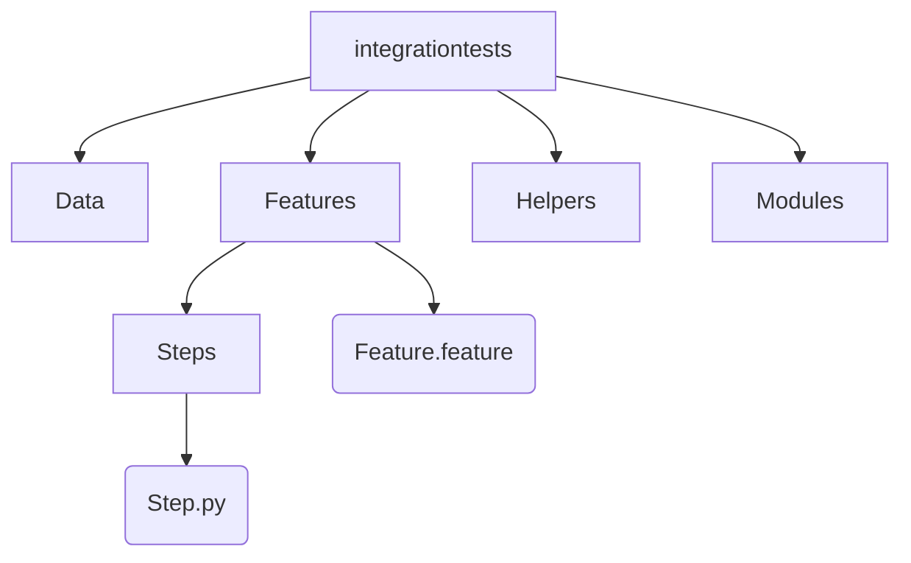

# Estrutura BDD
Visando garantir a qualidade do software através de testes automatizados foi utilizado o framework **BDD** ([Behavior Driven Development](https://pt.wikipedia.org/wiki/Behavior_Driven_Development))
Para melhor organização dos arquivos, segue abaixo as instruções de pastas e arquivos.

## Pastas 
**1 - integrationtests**
Pasta onde toda a estrutura do BDD está organizada

**1.1 - Data**
Subpasta onde serão armazenados arquivos necessários para o projeto, sejam arquivos de configurações ou até mesmo alguma imagem necessária

**1.2 - Features**
Subpasta onde os arquivos de comportamento dos testes.
 **1.2.1 - Steps**
Subpasta onde estarão a programação dos testes de acordo com o comportamento.
**1.3 - Helpers**
Subpastas com os arquivos com classes pré definidas que podem ser reaproveitadas 
**1.4 - Modules**
Subpasta onde toda a lógica da programação utilizada na pasta  Steps.

## Arquivos
**requiriments.txt:** Arquivo onde estarão listadas todas as bibliotecas Python utilizadas nos testes, que será utilizado para instalar essas bibliotecas de forma.
**Feature.feature:** Nomear de acordo com a feature testada(ex: Login.feature), nele deve está descrito o comportamento do teste de forma que qualquer pessoa que ler o arquivo consiga entender sem dificuldades.

    Funcionalidade: Login

    Cenario: Logar com sucesso

        Dado esteja na área de login
        Quando eu efetuo o login
        Então eu devo ser redirecionado para a area logada

**Steps.py:**  Dentro da pasta Steps, aqui estão os steps programados para a execução dos cenários de testes.
**Module.py:** Dentro da pasta Modules, o nome é opicional pois aqui está toda lógica de programação implementada pelos steps.